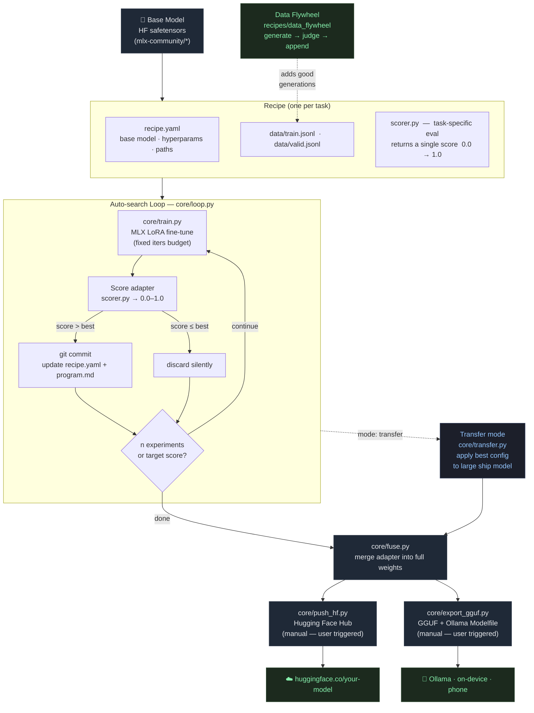

# mlx-forge

[](https://github.com/abdouloued/mlx-forge/actions/workflows/tests.yml)
[](https://github.com/abdouloued/mlx-forge/actions/workflows/lint.yml)
[](LICENSE)
[](https://python.org)
[](https://apple.com/silicon)

**Overnight, your Mac fine-tunes and ships a model that runs on your phone — with the evals to prove it's actually good.**

mlx-forge is a Mac-native fine-tuning factory. It takes an open-weight model, fine-tunes it for a specific task using MLX on Apple Silicon, proves the result is good with a real per-task evaluation, and exports it for deployment to Hugging Face and Ollama.

> Loop pattern inspired by Karpathy's [autoresearch](https://github.com/karpathy/autoresearch).
> This project differs fundamentally: **fine-tuning existing models** (not pretraining from scratch), **Apple Silicon / MLX** (not NVIDIA/CUDA), **multi-task factory** with pluggable per-task recipes, **evals as a first-class product**, and the goal is **shippable, useful models** — not a research-philosophy demo.

---

## Why evals first?

Most fine-tuning tools show you a loss curve and call it done. mlx-forge makes evaluation the centre of the workflow. Without a trustworthy eval, a loop just produces bad models faster. Every recipe ships a real `eval.py` that returns a single comparable score (0–1). The auto-search loop (Phase 2) uses that score as the ratchet — it only keeps experiments that beat the current best.

---

## Hardware requirements

| Mac | RAM | 7B 4-bit LoRA (500 iters) | Inference |
|-----|-----|--------------------------|-----------|
| M1 | 8GB | ~35 min (rank=4, batch=2) | fast |
| M2 Pro | 16GB | ~25 min | fast |
| M2 Max | 32GB | ~18 min | fast |
| M3 Max | 128GB | ~12 min | fast |
| M4 Ultra | 192GB | ~8 min | fastest |

Unified memory matters: base model weights and LoRA adapter share the same pool — no VRAM wall. A 7B model at 4-bit quantisation fits in 4–6GB, leaving the rest free for the adapter and activations.

---

## Requirements

- Apple Silicon Mac (M2 Pro or better recommended; 128GB unified memory ideal)
- macOS 14+
- [uv](https://docs.astral.sh/uv/) — `brew install uv`
- `mlx-lm` 0.30+ (installed via uv below)
- For GGUF export: [llama.cpp](https://github.com/ggerganov/llama.cpp) built locally
- For Ollama publishing: [Ollama](https://ollama.ai) 0.4+

> The test suite (all mocked) runs on any Mac without Apple Silicon or a model download.
> Real training requires Apple Silicon.

---

## Quick start

```bash
# 1. Clone and install
git clone https://github.com/abdouloued/mlx-forge
cd mlx-forge
uv sync

# 2. Run the test suite (no model needed)
uv run pytest -v

# 3. Download the base model
#    Verify the model ID at https://huggingface.co/mlx-community before use
uv run python -c "from mlx_lm import load; load('mlx-community/Qwen2.5-7B-Instruct-4bit')"

# 4. Fine-tune on the tool-calling recipe
uv run python -m core.train --recipe recipes/toolcalling/recipe.yaml

# 5. Evaluate the trained adapter
uv run python -m recipes.toolcalling.eval \
  --model-path adapters/toolcalling \
  --data-path recipes/toolcalling/data/valid.jsonl
# → tool_calling_score=0.XXXX   (1.0 = perfect on all 8 validation examples)

# 6. Fuse the adapter into full weights
uv run python -m core.fuse --recipe recipes/toolcalling/recipe.yaml
```

---

## Publish to Hugging Face (manual — you decide when it's ready)

```bash
# Authenticate once
uv run huggingface-cli login

# Upload the fused model
uv run python -m core.push_hf \
  --recipe recipes/toolcalling/recipe.yaml \
  --repo-id your-username/qwen2-5-7b-toolcalling
# Add --public to make the repo public
```

---

## Publish to Ollama (manual)

Requires llama.cpp built locally. Verify `convert_hf_to_gguf.py` path and `llama-quantize`
binary name against your llama.cpp version before running.

```bash
# Step 1: Convert fused safetensors → GGUF + generate Modelfile
uv run python -m core.export_gguf \
  --fused-path fused/toolcalling \
  --output-gguf exports/toolcalling/model-q4_k_m.gguf \
  --llama-cpp-dir ~/llama.cpp \
  --quantization Q4_K_M \
  --system-prompt "You are a helpful assistant with access to tools."

# Step 2: Register with Ollama and run
cd exports/toolcalling
ollama create qwen-toolcalling -f Modelfile
ollama run qwen-toolcalling

# Step 3: (Optional) push to Ollama registry
ollama push your-username/qwen-toolcalling
```

---

## Eval scoring rubric (tool-calling)

Each model response is scored on four criteria — each worth 0.25 of the total:

| Criterion | What it checks |
|---|---|
| `called_tool` | Output is a parseable tool call, not prose |
| `valid_json` | Arguments field is a valid JSON dict |
| `correct_name` | Function name matches the expected function |
| `correct_args` | All expected argument keys are present with correct values |

Score of `1.0` means the model called the right function with the right arguments on every validation example. A score above `0.85` is strong for a small adapter on a 500-iter run.

---

## Recipes

| Recipe | Task | Scorer | Status |
|---|---|---|---|
| `toolcalling` | JSON tool-call generation | 4-criterion: called/valid/name/args (0–1) | Phase 1 ✓ |
| `edge_android` | Compact assistant for mobile | correctness + conciseness (0–1) | Phase 3 ✓ |
| `healthcare_coding` | ICD-10 coding + abstention | correct code or correct refusal (0–1) | Phase 3 ✓ |

### Transfer mode (large ship models)

When your target model is too large to sweep directly (27B+), use `mode: transfer`:

```yaml
# recipe.yaml
base_model: mlx-community/Qwen2.5-32B-Instruct-4bit  # ship model
mode: transfer
loop_model: mlx-community/Phi-4-mini-instruct-4bit    # small sibling for the loop
```

**Step 1 — run the loop on the small sibling:**
```bash
uv run python -m core.loop \
  --recipe recipes/toolcalling/recipe.yaml \
  --n-experiments 20
```

**Step 2 — apply the best config to the ship model once:**
```bash
uv run python -m core.transfer \
  --recipe recipes/toolcalling/recipe.yaml \
  --state-path loop_state.json
```

`core.transfer` reads `loop_state.json`, replaces the training target with `base_model`,
and runs one fine-tuning pass with the winning hyperparams.

### Add a new recipe

```bash
cp -r recipes/toolcalling recipes/my_recipe
```

Then:
1. Edit `recipe.yaml`: set `base_model`, tune hyperparams
2. Replace `data/train.jsonl` and `data/valid.jsonl` with your task data
3. Rewrite `eval.py`: implement `score_response(response, example) -> float` returning 0–1
4. Edit `program.md`: describe the search space for the Phase 2 loop

The only file you *must* rewrite is `eval.py`. The `core/` machinery is unchanged.

---

## Preparing your data

The model trains on chat JSONL — one JSON object per line with a `messages` array. See **[docs/data-guide.md](docs/data-guide.md)** for the full guide.

**Quick validation:**

```bash
uv run python -m core.datakit validate recipes/toolcalling/data/train.jsonl
# Total lines: 20 │ Valid: 20 │ Errors: 0
```

**Convert existing data to the right format:**

```bash
# From a CSV with question/answer columns
uv run python -m core.datakit convert \
  --from csv --input my_data.csv \
  --input-col question --output-col answer \
  --system "You are a helpful assistant." \
  --output recipes/my_recipe/data/train.jsonl

# From Q&A JSONL (input/output fields)
uv run python -m core.datakit convert \
  --from qa --input qa_pairs.jsonl \
  --output train.jsonl

# From Alpaca instruction format
uv run python -m core.datakit convert \
  --from instruction --input alpaca.jsonl \
  --output train.jsonl
```

The data guide covers minimum dataset sizes, recipe-specific formats (tool schemas, ICD-10 codes), the train/valid split, and a pre-training quality checklist.

---

## Architecture



**Core design principle:** `core/` machinery generalises across every task. `recipes/scorer.py` does not — every domain needs its own. Adding a task means adding a recipe; the machinery is untouched.

### File map

```
mlx-forge/
  core/
    config.py          # RecipeConfig dataclass + YAML loader + validation
    train.py           # wraps mlx_lm.lora
    fuse.py            # wraps mlx_lm.fuse
    export_gguf.py     # GGUF conversion + Ollama Modelfile
    push_hf.py         # Hugging Face upload
    loop.py            # auto-search ratchet
    transfer.py        # apply loop best config to large ship model
  recipes/
    toolcalling/       # reference recipe — build this first
    edge_android/      # compact on-device assistant
    healthcare_coding/ # ICD-10 coding + abstention
    data_flywheel/     # self-improving training data loop
  shared/formats/
    tool_schema.py     # tool-call structure validator
  tests/               # 120 unit tests — no model, no network needed
```

---

## Run the tests

```bash
uv run pytest -v
# → 120 passed in ~0.2s
```

No Apple Silicon, no model download, no network access required.

---

## Auto-search loop (Phase 2)

The overnight ratchet: propose a config change → train → score → keep if better (git commit) → repeat.

```bash
uv run python -m core.loop \
  --recipe recipes/toolcalling/recipe.yaml \
  --n-experiments 20 \
  --target-score 0.90 \
  --seed 42
```

Each experiment:
1. Picks one hyperparameter to vary (learning rate, LoRA rank, layers, or batch size)
2. Trains with the fixed `iters` budget from `recipe.yaml`
3. Scores the resulting adapter on `data/valid.jsonl`
4. If the score improves: updates `recipe.yaml` + `program.md`, commits to git
5. If not: discards silently (next experiment overwrites the adapter dir)

The loop stops when `--n-experiments` is exhausted or `--target-score` is reached. Git history is the experiment log — each kept run is one commit.

**The loop never calls `push_hf` or `export_gguf`.** Publishing is always manual.

### Steering the search

Edit `recipes/toolcalling/program.md` to adjust notes and context. The search space is currently:

| Param | Values tried |
|---|---|
| `learning_rate` | 5e-5, 1e-4, 2e-4, 5e-4 |
| `lora_rank` | 4, 8, 16, 32 |
| `lora_layers` | 8, 16, 24, 32 |
| `batch_size` | 2, 4, 8 |

---

## Troubleshooting

**OOM during training**
```bash
# Reduce memory pressure in recipe.yaml:
grad_checkpoint: true
batch_size: 2
lora_rank: 4
lora_layers: 8
```

**Score stays at 0.0 after training**

Check data format first — the scorer returns 0 for any malformed example:
```bash
uv run python -m core.datakit validate recipes/toolcalling/data/valid.jsonl
```
Also verify the adapter path exists: `ls adapters/toolcalling/`

**"Training failed with exit code 1"**

Run the command manually to see the real error:
```bash
uv run python -m mlx_lm lora --help
```
Common cause: mlx-lm version mismatch. Run `uv sync` to update.

**GGUF export fails**

`llama-quantize` must be on `$PATH`. Check:
```bash
which llama-quantize || which llama-quantize-metal
```
If missing, build llama.cpp with `cmake -DLLAMA_METAL=on` and add the `build/bin/` dir to your PATH.

**HuggingFace push fails with 401**
```bash
uv run huggingface-cli login
```

**TUI won't launch**

Requires Textual 0.70+. Check version:
```bash
uv run python -c "import textual; print(textual.__version__)"
```

**Loop doesn't improve the score**

- Dataset too small: ensure ≥100 train examples per recipe
- Search space exhausted: the loop randomises within `SEARCH_SPACE` in `core/loop.py` — if all values have been tried, add new values
- Eval is non-deterministic: temperature-based generation can vary — add `temperature=0.0` to the generate call in `eval.py`

See [docs/troubleshooting.md](docs/troubleshooting.md) for more.

---

## Hard constraints

- MLX only — no NVIDIA/CUDA assumptions
- Fine-tuning existing open-weight models only — no pretraining from scratch
- LoRA/QLoRA for anything above the small tier — no full fine-tuning of large models
- Publishing is always manual (user-triggered) — the loop never calls `push_hf` or `export_gguf`
- Base model must be HuggingFace safetensors format — GGUF cannot be used as a fine-tuning starting point
